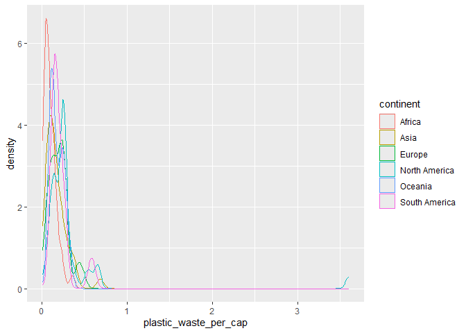
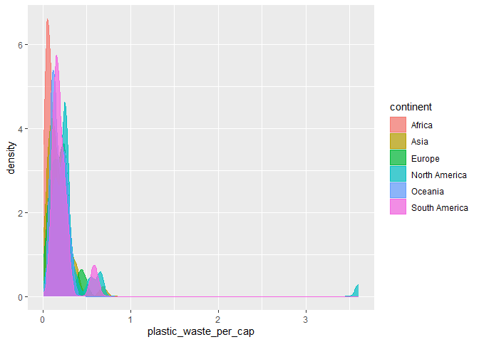
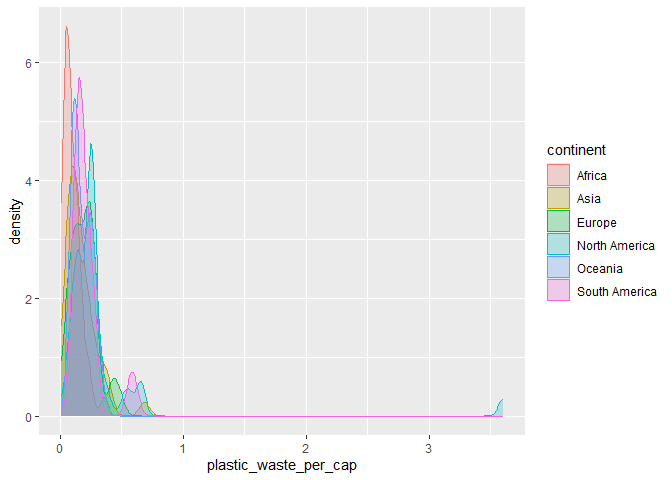
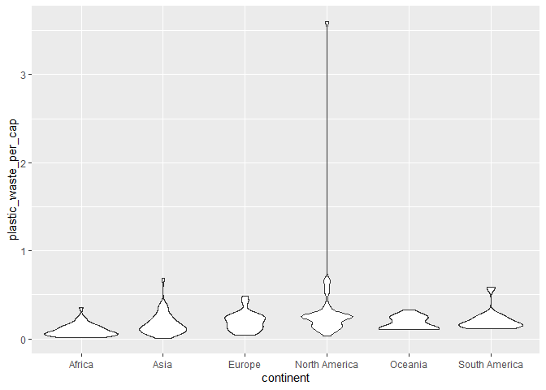
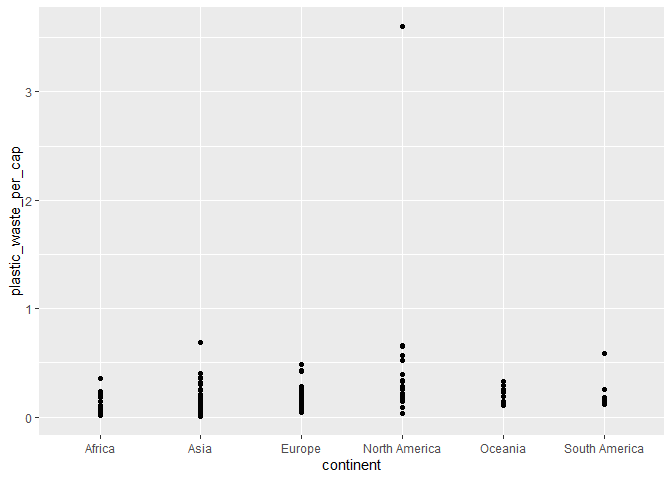

Lab 02 - Plastic waste
================
Ben Waggener
01/21/2025

## Load packages and data

``` r
library(tidyverse) 
```

``` r
plastic_waste <- read.csv("data/plastic-waste.csv")
```

## Exercises

### Exercise 1

Here is the plastic-waste-continent data plotted as a frequency graph

``` r
ggplot(data = plastic_waste, aes(x = plastic_waste_per_cap)) +
  geom_histogram(binwidth = 0.2)
```

    ## Warning: Removed 51 rows containing non-finite outside the scale range
    ## (`stat_bin()`).

<!-- -->

Here is the dataset filtered so that it only shows countries with
plastic waste per capita that is greater than 3.5kg per person

``` r
plastic_waste %>%
  filter(plastic_waste_per_cap > 3.5)
```

    ##   code              entity     continent year gdp_per_cap plastic_waste_per_cap
    ## 1  TTO Trinidad and Tobago North America 2010    31260.91                   3.6
    ##   mismanaged_plastic_waste_per_cap mismanaged_plastic_waste coastal_pop
    ## 1                             0.19                    94066     1358433
    ##   total_pop
    ## 1   1341465

This shows that the outlier from the previous graph is Trinidad and
Tobago. This means that this country has a much higher rate of plastic
waste per capita compared to the other countries in this dataset.
Quickly looking online, it seems that this is not a “data error” and
that much of this is caused by “inadequate waste management” (according
to Forbes)

Below shows each continent as a density plot.

``` r
ggplot(
  data = plastic_waste,
  mapping = aes(
    x = plastic_waste_per_cap,
    color = continent
  )
) +
  geom_density()
```

    ## Warning: Removed 51 rows containing non-finite outside the scale range
    ## (`stat_density()`).

<!-- -->

This graph is similar but has all the continents filled in.

``` r
ggplot(
  data = plastic_waste,
  mapping = aes(
    x = plastic_waste_per_cap,
    color = continent,
    fill = continent
  )
) +
  geom_density(alpha = 0.7)
```

    ## Warning: Removed 51 rows containing non-finite outside the scale range
    ## (`stat_density()`).

<!-- -->

### Exercise 2

“2.1. Recreate the density plots above using a different (lower) alpha
level that works better for displaying the density curves for all
continents.”

Here is a density plot with a lower alpha to better display the data.

``` r
ggplot(
  data = plastic_waste,
  mapping = aes(
    x = plastic_waste_per_cap,
    color = continent,
    fill = continent
  )
) +
  geom_density(alpha = 0.25)
```

    ## Warning: Removed 51 rows containing non-finite outside the scale range
    ## (`stat_density()`).

<!-- -->

“2.2. Explain why we defined the color and fill of the curves by mapping
aesthetics of the plot but we defined the alpha level as a
characteristic of the plotting geom.”

My answer: ‘aes’ is used to communicate to R what data to use whereas
‘geom’ says how to display that data. In the graph above, the x axis
displays plastic waste per capita while color and fill display
continent. These are under the ‘aes’ function in R. Alpha refers to the
color transparency which is a quality of the data visualization rather
than identifying the data itself.

“And yet another way to visualize this relationship is using
side-by-side box plots.”

``` r
ggplot(
  data = plastic_waste,
  mapping = aes(
    x = continent,
    y = plastic_waste_per_cap
  )
) +
  geom_boxplot()
```

    ## Warning: Removed 51 rows containing non-finite outside the scale range
    ## (`stat_boxplot()`).

<!-- -->

### Exercise 3

“Convert your side-by-side box plots from the previous task to violin
plots. What do the violin plots reveal that box plots do not? What
features are apparent in the box plots but not in the violin plots?”

Here is the side-by-side box plots as violin plots. The violin plots
show the distribution of data better. The violin plots make the
differences in data distribution (especially the shape near the mean)
easier to see compared to the box plots.

``` r
ggplot(
  data = plastic_waste,
  mapping = aes(
    x = continent,
    y = plastic_waste_per_cap
  )
) +
  geom_violin(
    mapping = NULL,
  data = NULL,
  stat = "ydensity",
  position = "dodge",
  draw_quantiles = NULL,
  trim = TRUE,
  bounds = c(-Inf, Inf),
  scale = "area",
  na.rm = FALSE,
  orientation = NA,
  show.legend = NA,
  inherit.aes = TRUE
  )
```

    ## Warning: Removed 51 rows containing non-finite outside the scale range
    ## (`stat_ydensity()`).

<!-- -->

### Exercise 4

Remove this text, and add your answer for Exercise 4 here.

“4.1. Visualize the relationship between plastic waste per capital and
mismanaged plastic waste per capita using a scatterplot. Describe the
relationship.”

``` r
ggplot(
  data = plastic_waste,
  mapping = aes(
    x = continent,
    y = plastic_waste_per_cap)
  ) +
  geom_point()
```

    ## Warning: Removed 51 rows containing missing values or values outside the scale range
    ## (`geom_point()`).

<!-- -->

``` r
# insert code here
```

``` r
# insert code here
```

``` r
# insert code here
```

### Exercise 5

Remove this text, and add your answer for Exercise 5 here.

``` r
# insert code here
```
